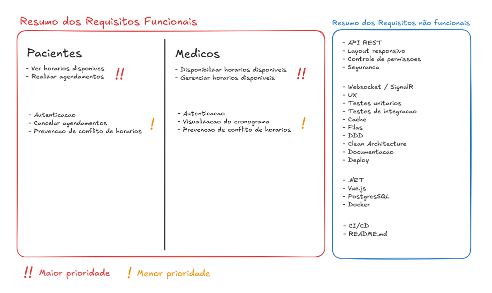
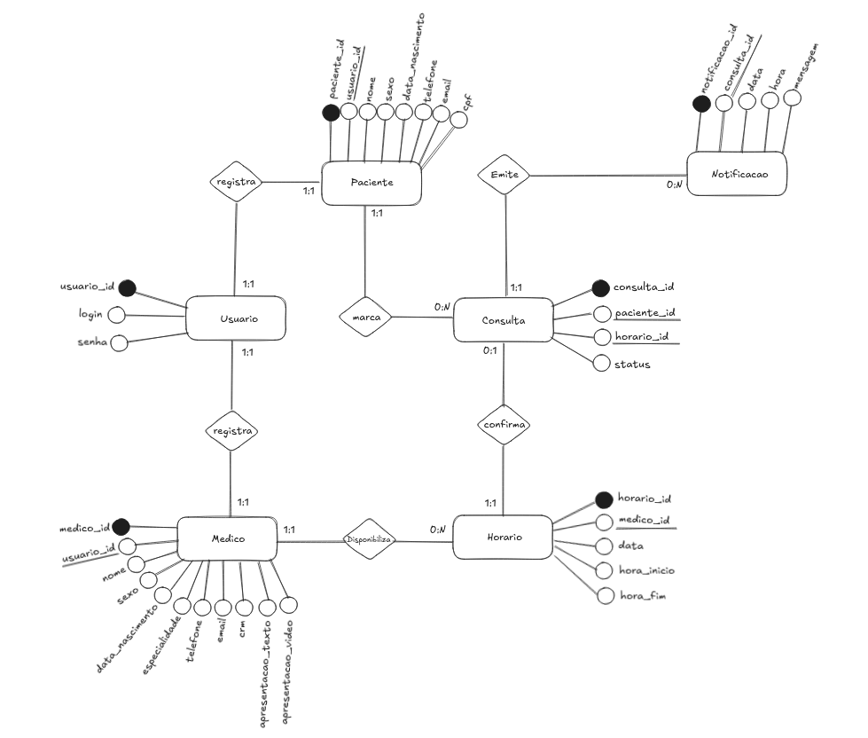
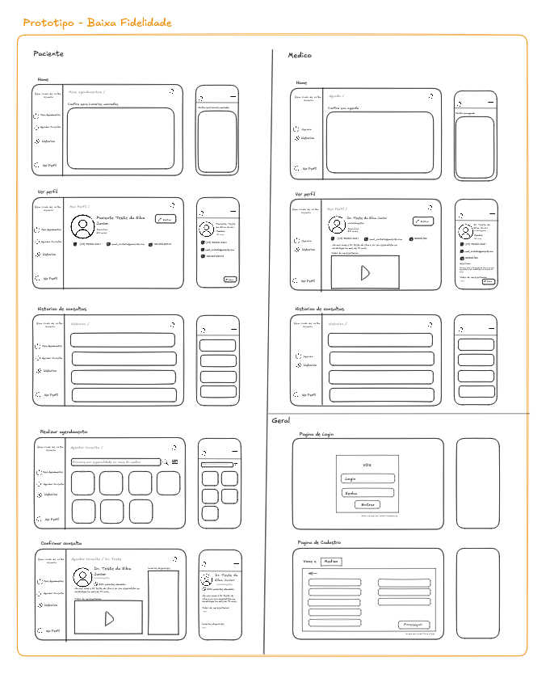

# 🩺 Sistema de Agendamento Médico

Este projeto foi desenvolvido como solução para o **Desafio Técnico – Desenvolvedor(a) Full-Stack (Pleno)**.  
O sistema permite que **médicos gerenciem seus horários** e que **pacientes visualizem e realizem agendamentos** de forma simples, segura e responsiva.


# 🌐 Deploy

O sistema pode ser acessado no enderesso:
👉 [http://179.232.19.87:5173](http://179.232.19.87:5173)
</br>
(pequeno servidor local a fim de testes)


# 🚀 Funcionalidades

## Backend
- Cadastro e atualização de horários disponíveis por médico.
- Listagem de horários disponíveis.
- Criação de agendamentos para pacientes.
- Prevenção de conflitos de horários.
- API REST com persistência em banco relacional.
- Autenticação e controle de acesso (médico/paciente).

## Frontend
- Interface para médicos gerenciarem seus horários.
- Interface para pacientes visualizarem e agendarem horários.
- Layout responsivo (desktop e mobile).

## Extras Implementados
- Atualizações em tempo real utilizando **SignalR**.
- Design de interface focado em **UX**.
- Estratégia de escalabilidade com **cache** e **filas** com boas práticas de arquitetura.
- Organização baseada em **DDD** e **Clean Architecture**.
- Testes automatizados unitários e de integração.
- Proteções contra injeções SQL e vulnerabilidades comuns.
- Documentação técnica detalhada.
- Deploy disponível em ambiente online.


# 🛠️ Tecnologias Utilizadas

## Frontend
- **Vue**
- **TypeScript**
- **TailwindCSS**
- **Axios**

## Backend
- **.NET 9 / C#**
- **Entity Framework Core**
- **SignalR** 
- **PostgreSQL**
- **Redis**


# 🗂️ Estrutura do Projeto
```
/backend/Vox
├── Application       # DTOs, Handlers, Services, ...
├── Domain            # Entidades, Interfaces, Enums, ...
├── Infrastructure    # Repositórios, Migrations, Configurações, ...
└── API               # Controllers, Middlewares, Program.cs, ...

│frontend
├── src
│   ├── components 
│   ├── assets
│   ├── layouts  
│   ├── public 
│   ├── store    
│   ├── views     
│   └── services     
```


# ▶️ Como Rodar Localmente o Projeto

### ⚙️ Pré-requisitos

- [Docker](https://www.docker.com/) e [Docker Compose](https://docs.docker.com/compose/)


```bash
$ git clone https://github.com/antonionetu/Desafio-Vox
$ cd sistema-agendamento-medico
$ docker compose up
```

Isso iniciará:

- Frontend em `http://localhost:5173`
- Backend em `http://localhost:5054`


# 🛡️ Segurança

- Autenticação via **JWT**.
- Criptografia de senhas com **bcrypt**.
- Controle de acesso por **roles** (médico/paciente).
- Validação de inputs contra injeções.
- Middleware global de tratamento de erros.


# 🧪 Testes

### Frontend
Para rodar os testes no frontend:
```bash
$ cd frontend
$ npm run test
```

### Backend
Para rodar os testes no backend:
```bash
$ cd backend
$ dotnet test
```

# 📚 Documentação

O projeto conta com documentação completa para facilitar entendimento, manutenção e evolução da aplicação.

### Documentos de Projeto
- **Requisitos**: Lista resumida dos requisitos funcionais e não funcionais do sistema.  
  

- **Diagrama ER (DER)**: Representa a modelagem do banco de dados e as relações entre as entidades.  
  

- **Protótipo de baixa fidelidade**: Layout inicial e fluxo das telas, mostrando a interface e experiência do usuário.  
  

Todos os documentos (Requisitos, DER e Protótipo) estão disponíveis em: [https://excalidraw.com](https://excalidraw.com/#json=qTOXie3p22EXal4J9LC5X,j6r_119uHOmUDfAno86JrQ)

### Backend
- **Swagger**: A API REST do backend está documentada com Swagger. É possível explorar todos os endpoints, parâmetros e respostas diretamente em:  [http://179.232.19.87:5054/api/docs](http://179.232.19.87:5173:5054/api/docs)  
  
